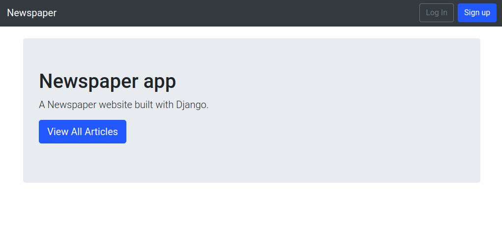

# Django newspapers app

Používá sql lite, bootstrap, sendgrid.



## Příkazy

Zprovoznění a spuštění:
```shell script
pipenv install
pipenv shell
python3 manage.py runserver
```

Nový projekt:
```shell script
pipenv install django
pipenv shell
mkdir new_project
cd new_project
django-admin startproject new_project .
python3 manage.py startapp users
python3 manage.py startapp pages
```

Po novém modelu:
```shell script
python3 manage.py makemigrations <app>
python3 manage.py migrate
```

Vytvoření superusera:
```shell script
python3 manage.py createsuperuser
```